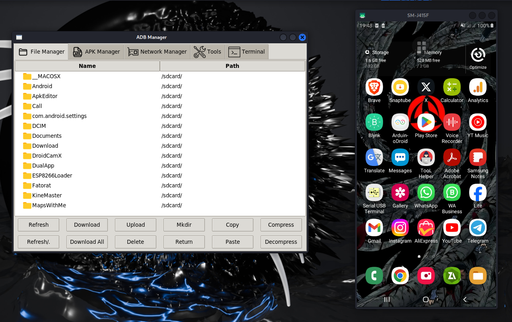

# ADB Manager - Comprehensive Android Debug Bridge Tool

ADB Manager is a **Graphical User Interface (GUI) tool** built with **Python** and **Tkinter**, designed to simplify **Android Debug Bridge (ADB)** operations.  
It provides an intuitive interface for **file management, APK handling, network controls, device tools, and ADB shell commands**.

<p align="center">
  
</p>

---

## 📌 **Features**

### 📂 **File Management**
- Browse the device file system with **icon-based visualization**.
- Upload/download files and folders.
- Create/delete directories.
- Copy/Paste operations.
- **Compress/Decompress files** (`tar.gz` format).
- Toggle hidden file visibility.

### 📦 **APK Management**
- **List all installed apps** with icons.
- Install/uninstall APKs.
- Enable/disable applications.
- **Extract APKs** from the device.
- Clear app data.
- Launch applications.
- View **detailed package information**.

### 🛠 **Device Tools**
- Take **screenshots** and save them automatically.
- Record the device screen.
- View **detailed device information**.
- Control **volume and power settings**.
- **Reboot device** (normal, recovery, bootloader).
- **Scrcpy integration** for screen mirroring.
- Start/Stop **ADB service**.

### 🌐 **Network Controls**
- Enable/disable **WiFi, Bluetooth, Airplane Mode, and Mobile Data**.
- Connect ADB **over TCP/IP**.
- Detect device IP addresses.

### 💻 **Terminal**
- Full ADB shell access with **real-time output**.
- Command history navigation (**Up/Down arrows**).
- Process control (`CTRL+C` support).
- Directory navigation shortcuts.

---

## 🛠 **Installation Guide**

### **1. Prerequisites**
Ensure the following are installed on your system:
- **Python 3.7 or higher** – [Download here](https://www.python.org/downloads/)
- **ADB (Android Debug Bridge)** – Installed and added to the system `PATH`
- **Android device** with **USB Debugging enabled**

### **2. Clone the Repository**
```bash
git clone https://github.com/Electro-Gamma/adb-manager.git
cd adb-manager
```

### **3. Install Required Python Packages**

This tool is **cross-platform** and works on:
- **Windows (10/11)**
- **Linux (Most distributions)**
- **macOS (10.15+)**

Install dependencies with:
```bash
pip install -r requirements.txt
```

### **Platform-Specific Notes**
| Platform  | Additional Notes |
|-----------|-----------------|
| **Windows** | ✅ No extra requirements – works out of the box |
| **Linux**  | 🔧 Run: `sudo apt-get install python3-tk` (for Debian/Ubuntu) |
| **macOS**  | 🍎 Run: `brew install python-tk` (via Homebrew) |

💡 **Troubleshooting**
- On **Linux/macOS**, use `pip3` if `pip` doesn't work.
- Add `--user` flag if getting **permission errors**:
  ```bash
  pip install --user -r requirements.txt
  ```
- For **ARM devices** (Raspberry Pi / Apple M1/M2 Macs), use:
  ```bash
  pip install --prefer-binary pillow
  ```


### **4. (Optional) Add Custom Icons**
- Place `.png` icon files inside the `icons/` directory.
- Ensure they match names in `icon_mappings.json`.

### **5. Run ADB Manager**
```bash
python app.py
```

---

## 🔌 **How to Connect Your Android Device**

1. **Enable USB Debugging on Your Android Device**  
   - Go to **Settings → About Phone → Tap "Build Number" 7 times** to enable **Developer Options**.
   - Navigate to **Developer Options → Enable "USB Debugging"**.

2. **Connect Your Device via USB**
   - Plug in your device to the computer via **USB cable**.
   - Run:
     ```bash
     adb devices
     ```
   - If prompted on your device, **allow debugging**.

3. **Run ADB Manager**
   ```bash
   python app.py
   ```
   - If the connection is successful, your device will be listed.

---

## 🎯 **Usage Guide**

### **1. Basic File Operations**
- **Double-click folders** to navigate.
- **Ctrl+Click or Shift+Click** to select multiple files/folders.
- Drag-and-drop file support (if implemented).

### **2. Take Screenshots**
- Screenshots are saved automatically in:
  ```
  device-pull/[device-model]/screenshot/
  ```

### **3. Record Screen**
- Screen recordings are saved in:
  ```
  device-pull/[device-model]/screenrecord/
  ```

### **4. Connect ADB Over WiFi**
1. Connect device via **USB** first.
2. Use **Network Manager** to get the device IP.
3. Click **"Connect"** to enable **ADB over TCP/IP**.
4. Disconnect USB, and **continue managing via WiFi**.

---

## ⚙ **Configuration Options**

### **Configuration Files**
- `icon_mappings.json` → Maps file extensions to icons.

### **Environment Variables**
- `ADB_PATH` → Override the default ADB executable path.
- `DEFAULT_SAVE_PATH` → Change the default download location.

---


## 📜 **License**
This project is licensed under the **MIT License**.  
See the [LICENSE](LICENSE) file for details.

---

## 🙌 **Acknowledgments**  
A huge thank you to the following tools and libraries that made this project possible:  

- **[ADB (Android Debug Bridge)](https://developer.android.com/studio/command-line/adb)** – A versatile command-line tool for communicating with Android devices, allowing debugging, file transfers, app installations, and shell access.  
- **[ADB-Toolkit](https://github.com/ASHWIN990/ADB-Toolkit)** – A powerful toolkit that simplifies ADB commands for managing Android devices, uninstalling bloatware, and debugging applications.  
- **[adbappcontrol](https://adbappcontrol.com/en/)** – A Windows GUI tool for managing Android apps via ADB, allowing app uninstallation, disabling system apps, and more.  
- **[Scrcpy](https://github.com/Genymobile/scrcpy)** – A lightweight and high-performance tool for screen mirroring and controlling Android devices via USB or Wi-Fi, with low latency and no root required.  
- **[Pillow](https://pypi.org/project/pillow/)** – A powerful image-processing library for Python, enabling image manipulation, conversion, and drawing operations.  
- **[Tkinter](https://docs.python.org/3/library/tkinter.html)** – A built-in Python library for creating graphical user interfaces (GUIs), providing a simple way to build desktop applications.  

---

### 🎉 **Enjoy managing your Android devices with ADB Manager!**

